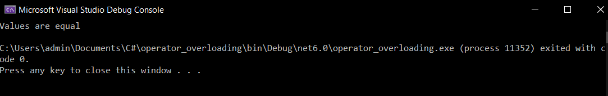

# EX-06 Operator-Overloading

## Aim:
 To write a C# program to pass values through constructors(default and parameterized) and also overload equal operators by checking whether objects are equal using operator overloading. 
 
## Algorithm:
 ### Step 1:
Create a class operator

### Step 2:
Pass values through the constructor

### Step 3:
return the bool operator, (==) and (!=)

### Step 4:
create a object to store the return object

### Step 5:
print the program.
 
## Program:
```
Developed by: Paul Andrew D
Register number: 212221230075
```
```c#
using System;
namespace operator_overloading
{
    class program
    {
        public int l;
        public program()
        {
            l = 10;
        }
        public program(int i)
        {
            l = i;
        }
        public static bool operator ==(program a, program b)
        {
            return a.Equals(b);
        }
        public static bool operator !=(program a, program b)
        {
            return !a.Equals(b);
        }
    }
    class example
    {
        public static void Main(string[] args)
        {
            program e1 = new program();
            program e2 = new program(10);
            e1 = e2;


            if (e1==e2)
            {
                Console.WriteLine("Values are equal");
            }
            else
            {
                Console.WriteLine("Values are not equal");
            }
        }
    }
}
```

## Output:
 
 

## Result:
Thus the C# program to check whether objects are equal using operator overloading is implemented successfully.
